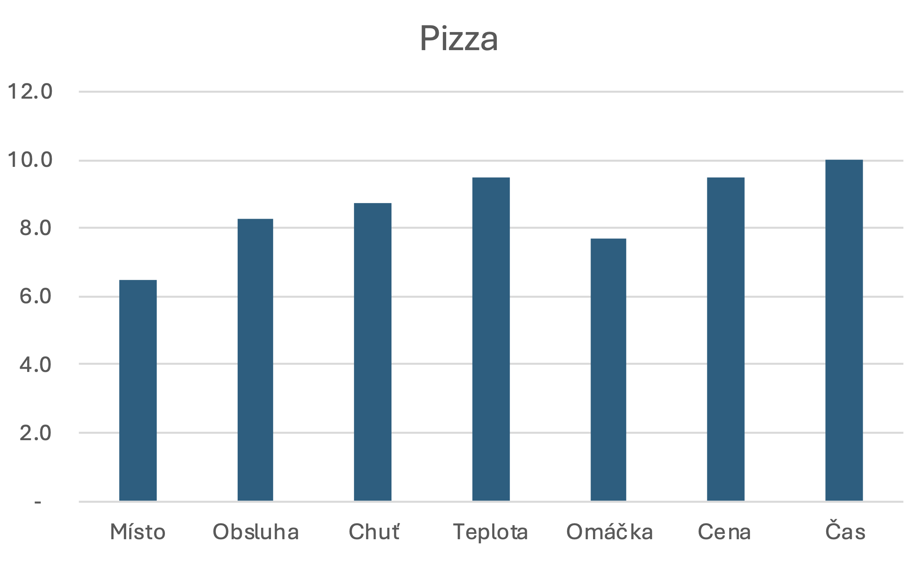

# Kebab House & Pizza

Tento kebab v našem výběru vyniká svou neobvyklostí. 
Maso, které se běžně dává do kebabu, na pizze bylo pro nás první a velice vítanou zkušeností. 
Na rozdíl od běžných kebabů jsme čekali poměrně dlouho – přece jen je to pizza – ale zážitek za to stál. 
Pizza byla velice sytá a kebabové maso se nečekaně hodilo k mozzarele. 
Skvěle se doplňovaly a společně vytvořily velice šťavnatý pokrm. Co jsme ale nečekali, byla mastnota.

Kvůli ceně 250 Kč jsme se rozhodli, že si každý dá pouze polovinu pizzy, a udělali jsme dobře. 
Pizza House byla nadmíru mastná, až tak, že bychom ji nejspíš nezvládli sníst celou, 
kdybychom se nerozdělili. Už polovina byla skoro příliš. Proto pokud se chystáte vyzkoušet Pizza House, 
doporučujeme přizvat kamaráda a pizzu si rozpůlit.

Snad si ale budete mít kam sednout, jelikož kebab na Hůrce nemá moc míst k sezení, 
kde by se dala pizza uvnitř vychutnat. Nabízí se možnost vzít si ji ven a sníst ji na lavičce, 
to ovšem moc nedoporučujeme, protože lavičky před Hůrkou nejsou moc čisté.

